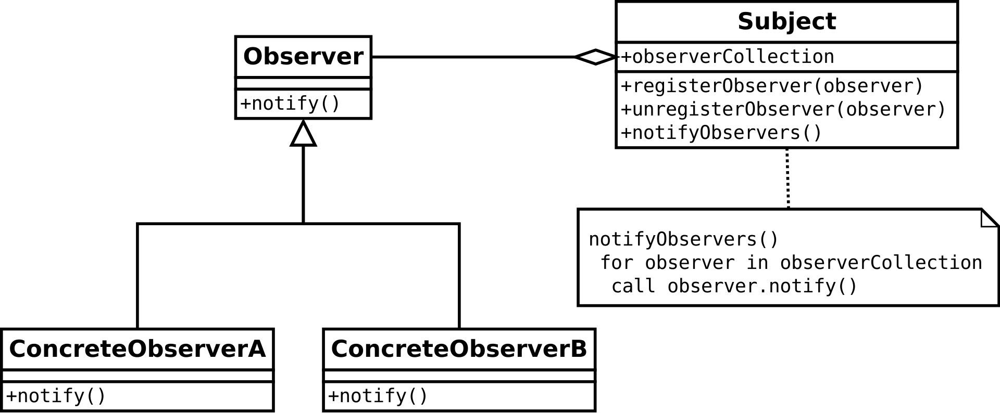

# Lexique

***Programmation réactive***: En informatique, la programmation réactive est un paradigme de programmation visant à conserver une cohérence d'ensemble en propageant les modifications d'une source réactive (modification d'une variable, entrée utilisateur, etc.) aux éléments dépendants de cette source.[...] La programmation réactive est née à partir du **patron de conception observateur** [...]


```ts
var b = 1
var c = 2
var a = b + c
b = 10
console.log(a) // 3 (not 12 because "=" is not a reactive assignment operator)

// now imagine you have a special operator "$=" 
// that changes the value of a variable (executes code on 
// the right side of the operator and assigns result to left 
// side variable) not only when explicitly initialized, but
// also when referenced variables (on the right side of the 
// operator) are changed
var b = 1
var c = 2
var a $= b + c
b = 10
console.log(a) // 12
```

***Observer Design Patern***: Le patron observateur est un patron de conception de la famille des patrons comportementaux. Il s'agit de l'un des vingt-trois patrons de l'ouvrage du « Gang of Four » Design Patterns – Elements of Reusable Object-Oriented Software1. 
Il est utilisé pour envoyer un **signal** à des modules qui jouent le rôle d'**observateurs**. En cas de notification, les observateurs effectuent alors l'action adéquate en fonction des informations qui parviennent depuis les modules qu'ils observent (les **observables**).



***RxJS***: Reactive Extensions Library for JavaScript
RxJS is a library for reactive programming using Observables, to make it easier to compose asynchronous or callback-based code. This project is a rewrite of *Reactive-Extensions/RxJS* with better performance, better modularity, better debuggable call stacks, while staying mostly backwards compatible, with some breaking changes that reduce the API surface

# Design Patern Observer
## Exemple 1
```ts
abstract class Observer {
  /**
   * Name of the observable used for unregister 
   */
  name: string = ""

  /**
   * Notify is called any time there is a notification triggered by the Subject
   */
  notify(): void { /* Abstract method */  }
} 

class ConcreteObserverA implements Observer {
  name = "ConcreteObserverA"
  notify(): void {
    console.log(this.name);
  }
}

class ConcreteObserverB implements Observer {
  name = "ConcreteObserverB"
  notify(): void {
    console.log(this.name);
  }
}

class Subject {
  /**
   * Collection of class that implement Observer
   */
  observerCollection: Observer[] = []

  /**
   * Add an observer to the collection
   * @param observer A class that implement Observer
   */
  registerObserver(observer: Observer): void {
    this.observerCollection.push(observer)
  }

  /**
   * Remove an observer from the collection
   * @param observer A class that implement Observer
   */
  unRegisterObserver(observer: Observer): void {
    this.observerCollection = this.observerCollection.filter(
      (obs) => (JSON.stringify(obs) !== JSON.stringify(observer))
    )
  }

  /**
   * Trigger the notify() method of all observer of the collection
   */
  notifyObservers(): void {
    for (const observer of this.observerCollection) {
      observer.notify()
    }
  }
}
```
Extrait de [exemple 1](apps/exemple1/src/index.ts)

## Limites

Ce type de programmation comporte cela dit quelque point négatifs:

- **Encapsulation**: Le patron de conception Observateur est souvent utilisé pour faire des machines à états. Malheureusement, les états sont souvent sauvegardés dans des variables qui doivent être visibles par tous les observateurs.

- **Manque de composabilité**: Le code qui en résulte n'est pas assez composable. Par exemple, il n'est pas toujours facile d'ajouter ou de supprimer un glisser-déposer (drag and drop) à un élément lorsqu'il y a beaucoup d'observateurs qui ont plus ou moins la même fonctionnalité.

- **Lisibilité réduite**: Il est difficile de faire correspondre les entrées aux sorties (syndrome du plat de spaghettis).

- **Gestion des ressources**: La vie d'un observateur doit être spécifiée explicitement, ce qui peut provoquer une mauvaise gestion des ressources. Dans certains cas, pour des soucis de performances, il est utile de n'activer un observateur qu'au moment où nous en avons besoin. Exemple : si l'utilisateur n'utilise pas le glisser-déposer (drag and drop), il est alors inutile de récupérer les coordonnées de la souris sans cesse.

- **Séparation des préoccupations**
Il faut diviser le code de sorte que chaque méthode ait sa propre fonctionnalité, et que celle-ci soit unique, autrement dit, il faut respecter le SRP (Single Responsible Principle). Exemple : Dans le cas d'une application qui sert à dessiner avec la souris, les observateurs de l'application ne vont pas que construire le chemin de la souris mais vont aussi appeler des méthodes pour l'afficher, ce qui n'est pas une bonne pratique.

- **Cohérence des données**: Avec le patron de conception Observateur, il n'y a aucune garantie que les données restent cohérentes.
  
- **Uniformité**: Le fait que la mise en place des différents observateurs est effectuée par plusieurs méthodes, diminue l'uniformité du code.

La programmation réactive est née à partir du patron de conception observateur afin de corriger ses défauts

# Programation Réactive
## Example
```ts
type Subscription<T> = (input: T) => void;

class Observer<T> {
  private subscriptions: Subscription<T>[] = [];

  constructor(_value?: T) {}

  subscribe(subscription: Subscription<T>): number {
    this.subscriptions = [...this.subscriptions, subscription];
    return this.subscriptions.length - 1;
  }

  unsubcribe(subscriptionId: number): void {
    this.subscriptions = this.subscriptions.filter((subscription, index) => {
      return index !== subscriptionId;
    });
  }

  next(value: T) {
    for (const subscription of this.subscriptions) {
      subscription(value);
    }
  }
}
```
Extrait de [exemple 2](apps/exemple2/src/index.ts)
## Concepts
La programmation réactive est basée sur des concepts comme des variations des valeurs dans le temps, des flots d’événements pour modéliser les mises à jour discrètes, des suivis de dépendances, et des propagations automatiques du changement.

### Valeurs qui varient dans le temps
À tout instant t de l'exécution du programme, toutes les expressions du programme doivent rester correctes. Par conséquent, les valeurs des variables évoluent dans le temps au fur et à mesure de l'exécution du programme de manière automatique et discrète.

### Flots d'événements
Lorsqu'une variable change de valeur, toutes les variables qui dépendent d'elle sont mises à jour, ce qui nécessite un événement / message.

*Il est important en programmation réactive d'écouter tous les événements qui peuvent survenir.*

### Suivis de dépendances
Les dépendances entre les variables, directes ou indirectes, doivent être suivies. Si une nouvelle dépendance fait son apparition, alors elle devra être sauvegardée afin de pouvoir propager dans un futur proche, d'éventuelles mises à jour de valeurs.

## Propagations automatiques du changement
Lorsqu'une variable subit une mise à jour, toutes les autres variables qui en dépendent doivent être informées afin qu'elles puissent se mettre à jour.

*La propagation doit se poursuivre automatiquement jusqu'à ce que toutes les variables qui en dépendent directement ou indirectement soient à jour.*

# Source

- https://fr.wikipedia.org/wiki/Programmation_r%C3%A9active
- https://www.npmjs.com/package/rxjs
- https://rxjs.dev/

